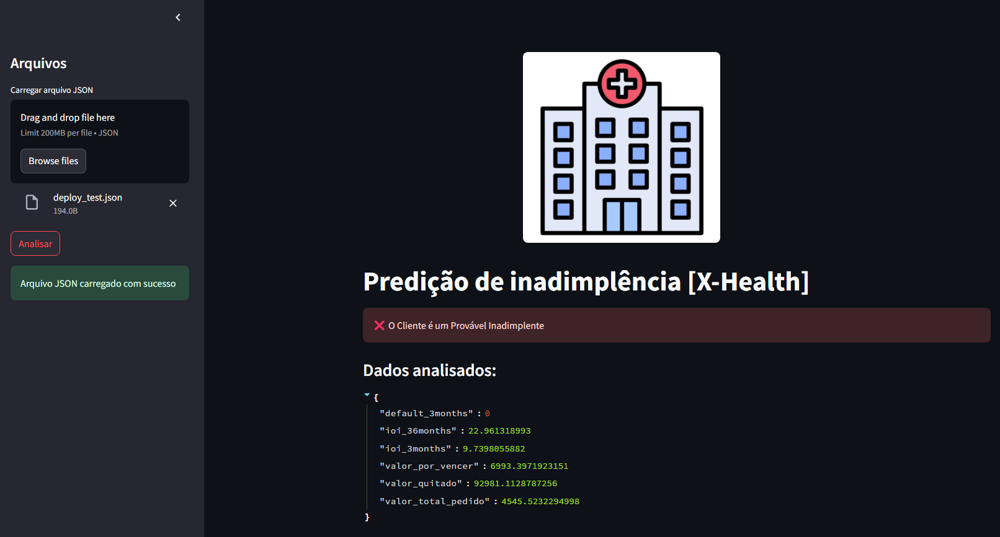

# Default Analysis Challenge X-Health

Bem-vindo ao repositório do projeto Default Analysis Challenge! Este documento explica como configurar o ambiente e fornece uma visão geral da estrutura do projeto.

---
<p align="center">
  
</p>

---

### Mapa do Projeto 

Consulte o arquivo `Project_Map.md` na raiz para um mapa detalhado da estrutura de pastas e arquivos. Ele serve como guia para navegação fácil pelo repositório.

---

## Setup Inicial

Para começar, siga estas instruções:

1. **Navegue até a pasta Setup**  
   - Acesse a pasta `/Setup` deste repositório no terminal.

2. **Execute o script de configuração**  
   - Rode o comando:  
    
        - ```python Project_setup.py``` ou ```python3 Project_setup.py```, dependendo do seu sistema.

> **Nota:** Certifique-se de executar o script na **pasta raíz** do projeto **`/Default_Analysis_Challenge`**, que é o nome deste repositório.

3. **Pré-requisitos**  
    - O Python deve estar instalado na máquina que vai executar o projeto. (Recomendado Python 3.8 ou superior).
    - O script criará um ambiente virtual em `<repo>/Python/ds-challenge` e instalará todas as dependências listadas em `<repo>/Build/requirements.txt`.

4. **Resultado**  
    - Após a execução, o ambiente virtual estará pronto em `<repo>/Python/ds-challenge`, com todas as dependências instaladas.

5. **Usando os Notebooks**
    - O ambiente virtual criado em **`<repo>/Python/ds-challenge`** deve ser apontado como **kernel** em **todos** os Jupyter Notebooks que forem ser utilizados no projeto.
    - Isto é fundamental para a correta execução dos códigos da análise exploratória e modelagem.
---

#### Solução de Problemas
Se houver falhas ao executar `Project_setup.py`, use os scripts manuais localizados em **`<repo>/Build`**:

> **Nota:** Certifique-se de executar o script na pasta **`<repo>/Build`**

- **Windows**:  
  - Execute `create_env.bat`.

    - ```cd Build & create_env.bat```

- **Linux/Mac**:  
    - Execute `create_env.sh`

        - ```cd Build && chmod +x create_env.sh && ./create_env.sh```

> Esses scripts fazem o mesmo que o **`Project_setup.py`**: criam o ambiente virtual e instalam as dependências.

---

### Estrutura do Projeto

Uma visão geral das pastas principais e seu conteúdo:

- **`Build`**  
    - Contém arquivos de suporte para configuração do ambiente:  
        - `requirements.txt`: Lista de dependências do projeto.  
        - `create_env.bat` e `create_env.sh`: Scripts manuais para criar o ambiente virtual.

- **`Challenge`**  
    - Inclui informações sobre o desafio:  
        - `README.md`: Detalhes específicos do desafio.

- **`Data`**  
    - Armazena os dados do projeto:  
        - `Raw`: Dados brutos fornecidos pelo desafio.
        - `Refined`: Dados processados e limpos
        - `Training`: Dados preparados para treinamento.

- **`Models`**  
    - Contém os recursos de modelagem e predição de ciência de dados:  
        - `Deploy`: Modelos para deploy em produção.
        - `Dev`: Modelos para desenvolvimento e testes.

- **`Modules`**  
    - Módulos Python reutilizáveis:  
        - `Api.py`: Funcionalidades de API.  
        - `Tables.py`: Manipulação de tabelas.  
        - `Training.py`: Treinamento de modelos.
        - `Predict.py`: Predição de novos resultados.

- **`Python`**  
    - Pasta onde o ambiente virtual `ds-challenge` é criado.
        - `ds-challenge`: Deve ser apontado como kernel no Jupyter Notebook.

- **`Setup`**  
    - Contém o script de configuração:  
        - `Project_setup.py`: Script principal para setup do ambiente.

- **`Test`**  
    - Possui um Json de exemplo para testar o modelo em produção:  
        - `deploy_test.json`: Exemplo de entrada para o modelo.
        
---

### Notebooks do Desafio

Na raiz do projeto, temos três notebooks:

1. **`Analise_Exploratoria_dos_Dados.ipynb`**  
    - Realiza a análise exploratória inicial dos dados, com visualizações e insights.

2. **`Default_Analysis_Challenge.ipynb`** 
    - Contém o processo de modelagem, incluindo pré-processamento, treinamento e avaliação dos modelos.
    - Contém todas as etapas do projeto, desde a análise exploratória até a modelagem e testes. 
    - Ele foi criado inicialmente, e então dividido em três partes conforme o desafio pede nas especificações.

3. **`Teste_do_Modelo.ipynb`**  
    - Dedicado a testes com novos valores e validação do modelo final.

> **Nota:** Os três primeiros podem ser usados independentemente, conforme o desafio exige.


### Deploy:

<p align="center">
  
</p>

Na raiz do projeto, temos o arquivo:

- **`Deploy.py`**:
    - Contém o código para deploy do modelo em produção.
    - Utiliza o módulo `Api.py`
    - Tem validação do json de entrada
    - É feito em **`Streamlit`**, uma biblioteca Python para criar aplicativos web interativos.

Para executar o deploy, siga os passos:
1. **Ative o ambiente virtual**:  
   - No terminal, navegue até a pasta do ambiente virtual e ative-o.
    - **Windows**: `cd Python/ds-challenge/Scripts && activate`
        - Em caso de problemas, também pode tentar a alternativa: 
        - Copie e cole o caminho direto para o script no Terminal: 
            - > C:\ **<caminho absoluto do repositório>**\Python\ds-challenge\Scripts\Activate.ps1
            - Assim, o ambiente virtual será ativado diretamente no terminal.
    - **Linux/Mac**: `cd Python/ds-challenge/bin && source activate`


2. **Execute o script de deploy**:  
   - No terminal, execute o comando:  
    - ```streamlit run Deploy.py```

